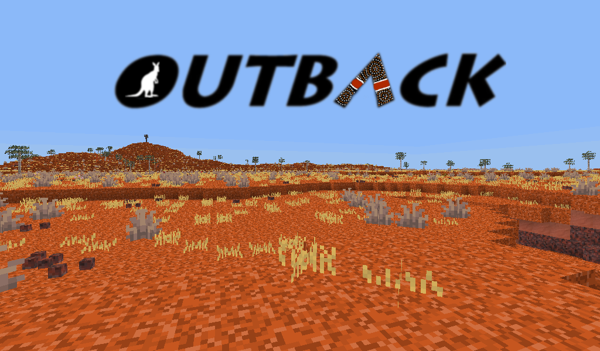

# Outback REDO

Original game created by vlapsley, updated for Minetest v5.5.1 by Josselin2.

[Discussion on Minetest Forums](https://forum.minetest.net/viewtopic.php?f=9&t=14412)

As of 20 June 2022, the original version of this game will not load on Minetest v5.5.1, and crashes frequently. In addition, a number of annoying errors/warnings are visible in the chat window. I have updated the code to make the game playable again, fixing the crashes, removing visible errors/warnings and updating some mods with newer versions.

All changes are preceded by '@@@ Josselin2':

Updated mods to modern versions: *basic_materials* *mesecons* *pipeworks* *technic*

*/biomes/..*

Merged *mod.conf* and *depends.txt*, then deleted *depends.txt*

*/biomes/central_australia.lua*

Replaced non-existent "technic:granite_mineral_uranium" with "technic:mineral_uranium"

*/biomes/pilbara.lua*

Replaced non-existent "technic:granite_mineral_chromium" with "technic:mineral_chromium"

*/outback/..*

Merged *mod.conf* and *depends.txt*, then deleted *depends.txt*

*/outback/nodes_base.lua*

Fixed missing brackets in "outback:mineral_salt", which caused a "bad argument #5 to 'register_item_raw'" error

Replaced the missing textures for aluminium by importing them from minetest_technic_aluminium, https://github.com/mrunderhill89/minetest_technic_aluminum (licence: LGPL, V2 or later)

Replaced the missing textures for nickel by importing them from real_minerals, https://github.com/FaceDeer/real_minerals (licence: GPLv3)

Replaced the missing textures for silver by importing them from moreores, https://github.com/minetest-mods/moreores (licence: CC BY-SA 3.0 Unported)

*/outback/nodes_misc.lua*

Commented out the missing inventory textures

*/outback/nodes_trees.lua*

Replaced the missing texture for mangrove saplings by importing one from australia, https://github.com/vlapsley/outback (licence: GNU LGPL v2.1)

*/plantlife/flowers_plus/init.lua*

Fixed attempts to grow non-existent "flowers:seaweed_1" (copied in replacement code from modern version of plantlife)

README.md

Replaced the URL to the screenshot

The rest of this file comprises the original README text.

## Gameplay

The inspiration for this game is my home country, Australia. I've tried to bring the landscape and flora into the game of Minetest. Enjoy and think of visiting Australia next time you travel abroad.

You can choose to play in a “survival mode” in which you have to fight monsters and hunger for survival and slowly progress through the various other aspects of the game, such as mining, farming, building machines, and so on. Or you can play in “creative mode” in which you can build almost anything instantly.

## Installation

### Download

1. [Download](https://github.com/vlapsley/outback/archive/master.zip) the .zip file
1. Extract the .zip archive with an archive manager (WinZip, 7-zip, gunzip...)
1. Rename the directory to *outback* and place it in the `/games` directory of Minetest.

### Using Git

1. Open the terminal (in Linux) or the Git shell (in Windows), and set the working directory (the *mods* folder) using `cd` - for example `cd /home/vlapsley/.minetest/games` or `cd C:\Users\vlapsley\minetest-0.4.16\games`
1. Clone (download) Outback game: `git clone https://github.com/vlapsley/outback.git`
1. Next time, you can automatically update the Outback game with the same `cd`command, and `git pull origin master`

## Completion status

This game is currently in **alpha** stage. It is playable, but very unfinished, many bugs are to be expected. Backwards-compability is *not* guaranteed, updating your world might cause small and big bugs (such as “missing node” errors or even crashes).

The following main features are available:

* Plenty of biomes to explore. Some are rich in resources, others barren and harsh.
* Trees, plants, bushes all native to Australia
* Saplings
* New stone - basalt, diorite, granite, limestone, shale, slate and red sandstone.
* Coral
* Chests
* Boats
* Fire
* Minecarts
* Torches
* Beds
* Books and bookshelves
* Dyes
* TNT

The following features are incomplete or not yet implemented:

* Buidling blocks: Stairs, slabs, doors, trapdoors, fences, fence gates, and walls.
* New ores - silver, nickel, zinc, lead, uranium and a reuse of mese.
* Precious stones - Agate, Amethyst, Citrine, Emerald, Jade, Opal, Ruby, Sapphire, Smoky Quartz, and Thunder Eggs.
* New fuel - crude oil
* Basic tools
* Technic mod (machines, nuclear reactor)
* Pipeworks
* Mesecons
* Mobs - Great White Shark, Tiger Shark, Saltwater Crocodile, Brown Snake, Tiger Snake, Emu, Kangaroo, and Wombat.
* Combat: weapons (bows, pistol, rifle) and armor (kevlar)
* Weather and seasons
* Ambient sounds
* Farming and crops
* Fishing
* Food recipies
* Potentially add renewable fruit on trees
* Wine and brewing
* Villages - Pub, cattle station, sheep station, simple crop farmhouse (apple, banana, sugar cane, pineapple, grapes/vineyard), general store.
* Hunger
* Thirst and drinking water
* Stamina, exhaustion.
* Additions to survival mode - poison (snake bite), medikits / first aid and Indigenous remedies.
* Shipwrecks - extend items stored in the wrecks chest.
* Sea grass and kelp
* Subterrane monsters - just enough to keep you on your toes. Probably zombies.
* Explore the skybox mod and potentially add some beautiful skylines.
* Crafting guide
* In-game help system
* Licenses and credits
* Readme files and API documentation

## Info for programmers

You find interesting and useful infos in `API.md`.
This project is currently mostly a one-person project.

## Legal information

### License of source code

Outback is licensed under the GNU LGPL v2.1 (vlapsley, minetest developers and countless others) 
(see `LICENSE.txt`).

### License of media (textures, models and sounds)

No non-free licenses are used anywhere.

See README.txt in each mod directory for detailed information about other authors.
